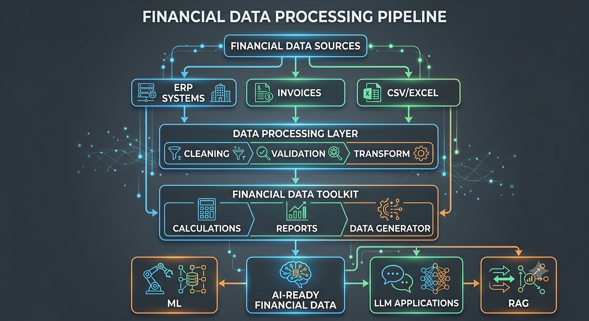

# Financial Data Tools 📊     
[](https://github.com/mandanahosseini/financial-data-tools/actions)


## Python Toolkit for Financial Data Processing, Automation & AI-Ready Enterprise Workflows

Financial Data Tools is an open-source Python toolkit designed to simplify financial data processing, automation, and preparation of enterprise financial data for analytics and Artificial Intelligence applications.

The project focuses on building reusable components for financial systems, ERP environments, and AI-powered business solutions.

---
## 🎯 Project Vision

Modern organizations generate large volumes of financial data through ERP systems, accounting software, invoices, and business transactions.

This project aims to provide practical tools for:

- Financial data processing
- Data quality improvement
- Financial workflow automation
- ERP data preparation
- AI-ready financial datasets
- Intelligent financial applications

The long-term goal is to bridge the gap between:

**Enterprise Financial Systems + Data Engineering + Artificial Intelligence**

---

# 🚀 Key Features

## 💰 Synthetic Financial Data Generation

Generate realistic synthetic financial datasets for analytics, testing, and AI development:

- Synthetic transaction generation
- Financial record simulation
- AI-ready dataset creation
- Privacy-preserving data generation


## 🧾 Invoice Intelligence

A foundation for intelligent financial document processing:

- Invoice data modeling and validation
- Financial document structure extraction
- Invoice processing pipelines
- Preparation for AI-powered document understanding


## 🏢 Enterprise ERP Data Preparation

Tools designed around enterprise financial workflows:

- Financial transaction processing
- Customer and supplier data preparation
- Business record management
- Reporting dataset generation


## 🧠 Financial NLP Pipeline

Natural Language Processing capabilities for financial documents:

- Text cleaning and normalization
- Financial entity extraction
- Document understanding foundation
- Transformer-ready text processing


## 🔍 Semantic Search & RAG Foundation

Building retrieval-based AI systems for financial knowledge:

- Text chunking pipeline
- Embedding generation
- Vector-based semantic search
- Retrieval-Augmented Generation (RAG) architecture


## 🤖 Financial AI Assistant

A foundation for LLM-powered financial assistants:

- Context-aware question answering
- Grounded responses using financial documents
- LLM integration architecture
- Enterprise AI assistant workflow


## 🌐 API & Deployment

Production-oriented deployment capabilities:

- FastAPI REST API
- Interactive API documentation with Swagger
- Docker containerization
- Reproducible deployment environment

---

# 🏗️ Project Architecture


---

# 📂 Project Structure


financial-data-tools/

├── src/
│ └── financial_tools/
│
├── data/
│ └── synthetic/
│
├── examples/
│
├── tests/
│
├── docs/
│
└── README.md


---


## 🚀 Deployment

The project can be deployed using Docker.

### Run with Docker Compose

```bash
docker compose up
```

The API will be available at:

```
http://localhost:8000
```

API documentation (Swagger UI):

```
http://localhost:8000/docs
```

### Stop the service

```bash
docker compose down
```

# 🛠️ Technologies

## Programming

- Python

## Data Processing

- Pandas
- NumPy

## Future AI Integration

- Scikit-learn
- PyTorch
- Transformers
- Large Language Models (LLMs)
- Retrieval-Augmented Generation (RAG)

---

# 📌 Current Status

🚧 This project is under active development.

Current focus:

- Designing the core architecture
- Building reusable financial data utilities
- Creating synthetic financial datasets

---

# 🗺️ Roadmap

## Phase 1 — Foundation

- [x] Project initialization
- [ ] Financial data models
- [ ] Synthetic transaction generator
- [ ] Basic validation tools


## Phase 2 — Financial Processing

- [ ] Invoice processing utilities
- [ ] Financial calculation modules
- [ ] Reporting components


## Phase 3 — AI Integration

- [ ] Financial document understanding
- [ ] OCR integration
- [ ] LLM-based financial assistant
- [ ] RAG knowledge systems


## Phase 4 — Enterprise Integration

- [ ] ERP connectors
- [ ] API services
- [ ] Production deployment examples


---

# 💡 Example Applications

Potential applications:

- Intelligent financial assistants
- ERP analytics systems
- Automated financial reporting
- Document AI pipelines
- Business intelligence solutions


---

# 👨‍💻 Author

**Mandana Hosseini**

Senior Data Scientist | AI Engineer | NLP & LLM Specialist

Research interests:

- Enterprise AI
- Natural Language Processing
- Large Language Models
- Financial AI
- Intelligent Business Systems


---

# 🤝 Contributions

Contributions, ideas, and discussions are welcome.

If you are interested in applying AI to financial systems, feel free to connect.
